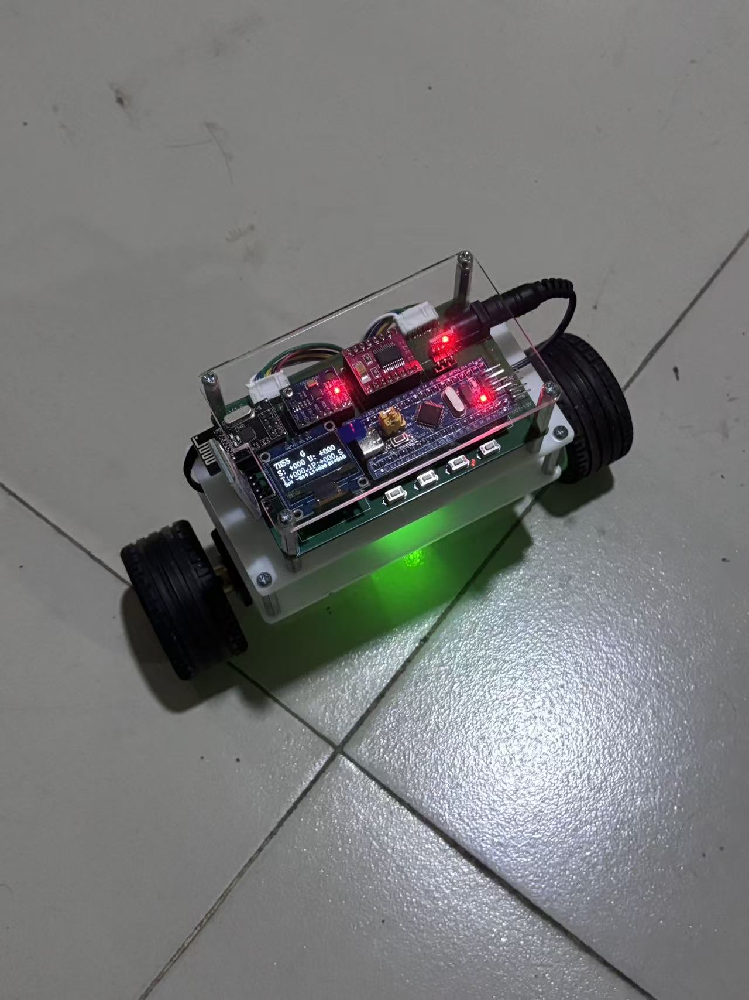

# 基于STM32 + FreeRTOS的两轮自平衡小车

## 项目简介

基于江协科技平衡小车硬件平台，将裸机代码重构为 FreeRTOS 多任务架构，实现姿态解算、PID 闭环平衡控制、蓝牙遥控等功能。

当前可运行版本在 OLED 上显示为 **7H55**：小车可自主站立，并通过 USART2 蓝牙串口接收摇杆/按键指令做前进、后退与转向。控制任务 10 ms 周期运行；速度环与转向环每 50 ms 更新一次，角度环每 10 ms 更新。

## 演示

实车照片：



B 站演示视频（点击封面跳转播放）：

[](https://www.bilibili.com/video/BV15SYu6iEiS)

- [平衡小车站立效果展示](https://www.bilibili.com/video/BV15SYu6iEiS)（约 11 秒）

[](https://www.bilibili.com/video/BV1VSYu6iEZf)

- [平衡小车蓝牙控制展示效果](https://www.bilibili.com/video/BV1VSYu6iEZf)（约 38 秒）

账号空间：[bili_77888709002](https://space.bilibili.com/1374157254)

## 硬件平台

以江协科技平衡小车控制板为准，引脚与接口来自本仓库源码（`main.h`、`tim.c`、`usart.c`、`encoder.c`、`oled.c`、`mpu6050.c`、`Balence.ioc`）。

| 模块 | 型号 / 接口 | 连接 |
|------|-------------|------|
| MCU | STM32F103C8T6，LQFP48，72 MHz（HSE 8 MHz × PLL9） | — |
| 电机驱动 | TB6612 | PWM：TIM2 CH1/CH2 → PA0/PA1；方向：PB12~PB15；STBY：PA15 |
| 左轮编码器 | TIM3 正交编码器 | PA6 / PA7 |
| 右轮编码器 | TIM4 正交编码器 | PB6 / PB7 |
| MPU6050 | 软件 I2C | PB10 = SCL，PB11 = SDA |
| OLED | 0.96 寸，4 针 I2C（软件 I2C） | PB8 = SCL，PB9 = SDA |
| 蓝牙串口 | USART2，9600 8N1 | PA2 = TX，PA3 = RX |
| 调试接口 | SWD | PA13 / PA14 |
| 电机型号 | TODO | 代码未写明具体减速电机型号 |
| 供电电池 | TODO | 代码未写明电压与节数 |

## 技术栈

C、FreeRTOS、PID、互补滤波、UART/I2C/PWM、Keil MDK、STM32CubeMX、Cursor。

## FreeRTOS 任务架构

CMSIS-RTOS v2。Tick = 1000 Hz，堆 `configTOTAL_HEAP_SIZE = 10240` 字节。因 F103C8 仅 20 KB RAM，控制/显示任务栈按字节收缩，避免任务创建失败。

| 任务名 | 优先级 | 栈大小 | 功能 | 通信方式 |
|--------|--------|--------|------|----------|
| ControlTask | `osPriorityHigh` | 2048 B | 10 ms 周期：MPU 更新、串级 PID、电机 PWM；50 ms 累计编码器做速度/转向环 | 读 `g_target_speed` / `g_target_turn`；`I2cMutex` 保护 MPU 软件 I2C；写 `g_snap` 给显示 |
| CommTask | `osPriorityNormal` | 1024 B | 解析蓝牙字节流，更新速度/转向目标；超时 600 ms 清零目标 | 从 `BleRxQueue` 取字节 |
| DisplayTask | `osPriorityBelowNormal` | 2048 B | OLED 显示姿态、速度目标、PWM 等，约 100 ms 刷新 | 读 `g_snap`、遥控目标 |
| defaultTask | `osPriorityNormal` | 512 B | 空闲占位，`osDelay(1000)` | 无 |

其它对象：

- `BleRxQueue`：64 × 1 字节消息队列。USART2 中断回调 `HAL_UART_RxCpltCallback` 入队。
- `I2cMutex`：互斥量，ControlTask 访问 MPU6050 时持有。

## 关键技术点

### 1. FreeRTOS 任务划分与实时性优化

平衡环放在最高优先级 `ControlTask`，用 `vTaskDelayUntil` 保证 10 ms 节拍。蓝牙解析与 OLED 刷新放到更低优先级，避免阻塞姿态闭环。MPU 软件 I2C 与 OLED 软件 I2C 引脚分离（PB10/11 与 PB8/9），并用互斥量保护 MPU 总线。F103C8 RAM 紧张，任务栈合计约 5.5 KB，堆 10 KB。

### 2. MPU6050 互补滤波姿态解算

软件 I2C 读取加速度与陀螺仪。俯仰角：

```
acc_angle = -atan2(AX, AZ) * 180/π + 0.5
pitch = (1 - α) * acc_angle + α * (pitch + gyro_y * dt)
```

其中 `α = 0.99`，`dt = 0.01 s`。上电后对陀螺仪 Y/Z 做 200 次静置校准；扶正后再采样机械中值 `g_mid_angle`，并叠加 `g_mid_trim = 0.02`。

### 3. 串级 PID 平衡控制与参数整定

结构：速度环输出作为角度环目标，转向环输出为左右轮差速 PWM。

| 环路 | 周期 | Kp / Ki / Kd | 输出限幅 |
|------|------|--------------|----------|
| 角度环 | 10 ms | 5.0 / 0.06 / 5.5 | ±100 PWM |
| 速度环（站立） | 50 ms | 0.5 / 0.005 / 0 | ±1.5° |
| 速度环（遥控前后） | 50 ms | 1.5 / 0.03 / 0 | ±4° |
| 转向环 | 50 ms | 3.5 / 1.5 / 0 | ±22 PWM |

其它已验证策略（详见 `pid.c` / `freertos.c` 注释）：

- 站立时关掉转向（`dif = 0`），用速度误差阻尼 `(Sp - 目标) × 28`，限幅 ±32。
- `|Sp| > 0.4` 时冻结速度环目标，避免串级把轮子泵起来。
- 倾倒角约 22° 停机，扶正后软启动再切入闭环。
- 右轮 PWM 死区补偿 `g_pwm_r_ofs = 2`。

### 4. 蓝牙遥控协议与指令解析

USART2 中断收字节 → 队列 → `CommTask` 解析。支持两种格式：

**括号包**（推荐，手机 App 摇杆）：

```
[joystick,<lh>,<lv>,<rh>]
[key,1,down] 或 [key,S,down]   停车
[F] [B] [L] [R] [S]            前后左右停
```

摇杆量程约 ±100，死区 ±4，映射为速度 ±8、转向 ±15；遥控目标再除以 25 后送入速度/转向环。纯前后时不借用左杆转向，避免拉满后退转圈。超过 600 ms 无新指令则清零目标。

**单字符**：`F` / `B` / `L` / `R` / `S`。

## 目录结构

```
Balence/
├── Core/
│   ├── Inc/                 # 头文件（pid、motor、mpu6050、oled、encoder、usart…）
│   └── Src/                 # 应用与驱动源文件
│       ├── freertos.c       # 任务、平衡环、蓝牙解析
│       ├── pid.c            # 串级 PID
│       ├── mpu6050.c        # 姿态解算
│       ├── motor.c          # TB6612 PWM
│       ├── encoder.c        # 左右编码器
│       ├── usart.c          # 蓝牙 USART2
│       └── oled.c / OLED_Data.c
├── Drivers/                 # STM32 HAL / CMSIS
├── Middlewares/
│   └── Third_Party/FreeRTOS/
├── MDK-ARM/
│   ├── Balence.uvprojx      # Keil 工程
│   └── startup_stm32f103xb.s
├── docs/
│   ├── images/              # 实车照片、演示 GIF
│   └── videos/              # H.264 演示视频
├── Balence.ioc              # STM32CubeMX 工程
├── README.md
└── LICENSE
```

## 编译与烧录

1. 使用 **Keil MDK** 打开 `MDK-ARM/Balence.uvprojx`。
2. 选择目标 `Balence`，Rebuild。生成文件位于 `MDK-ARM/Balence/`（该目录已加入 `.gitignore`）。
3. 用 **ST-Link** 或 **DAP-Link** 通过 SWD（PA13/PA14）下载。
4. 外设时钟与引脚也可由 `Balence.ioc` 在 STM32CubeMX 中查看；USART2 蓝牙、TIM2 电机 PWM 等在 User Code 中配置，重新生成代码时注意保留 User 段。

推荐工具链：Keil MDK-ARM，ARM Compiler 5（本机验证过 Armcc V5.06）。

## 作者

姓名：李润欣  
GitHub：lrx-6665  
邮箱：2339043687@qq.com

## 许可证

MIT License
